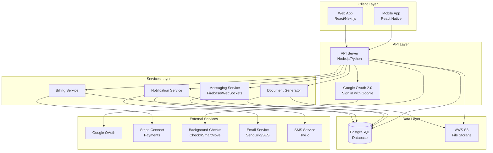
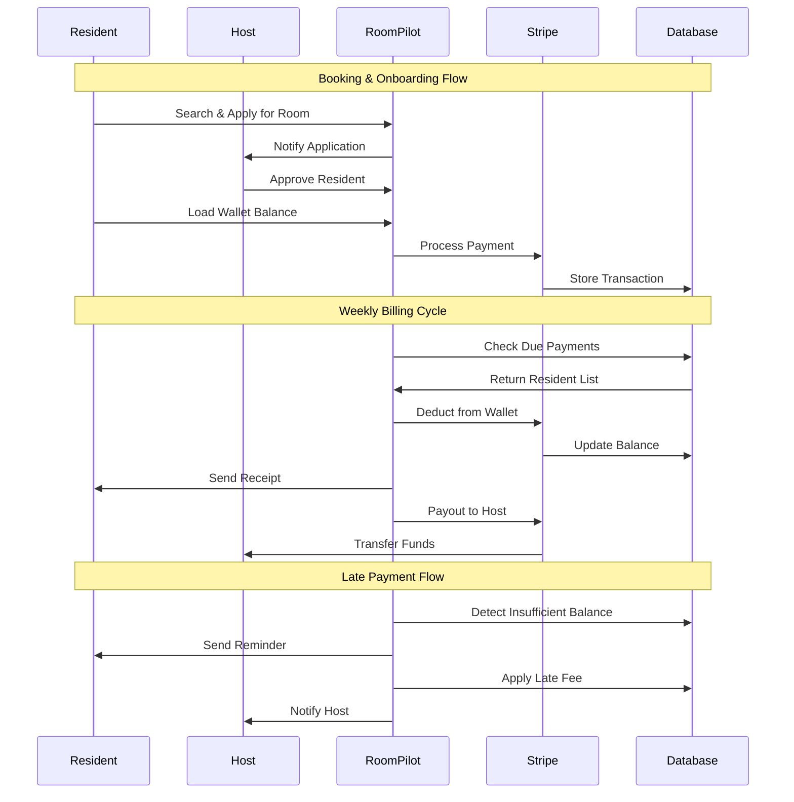
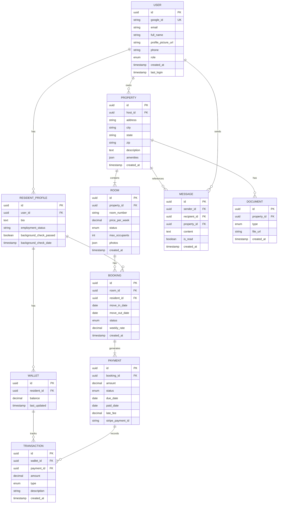
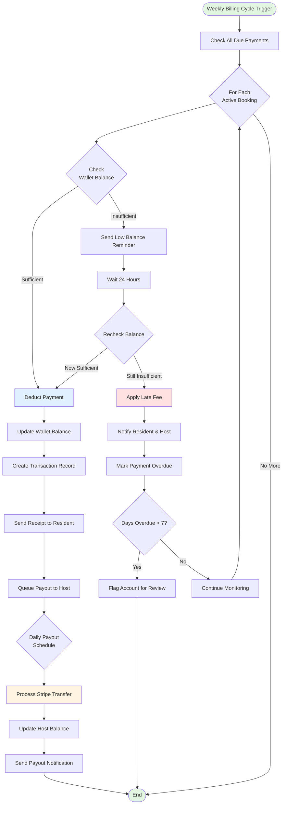
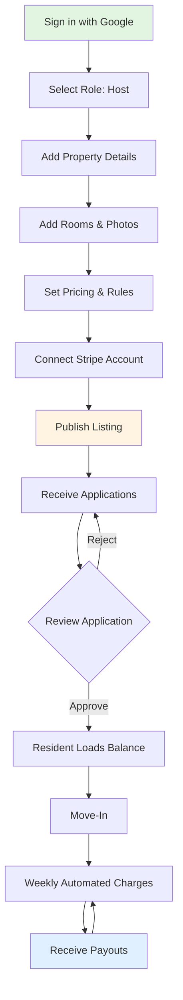
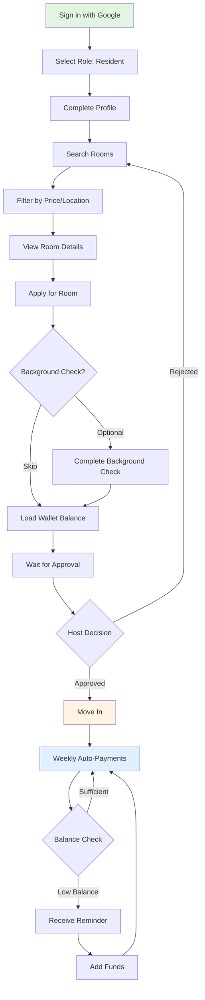
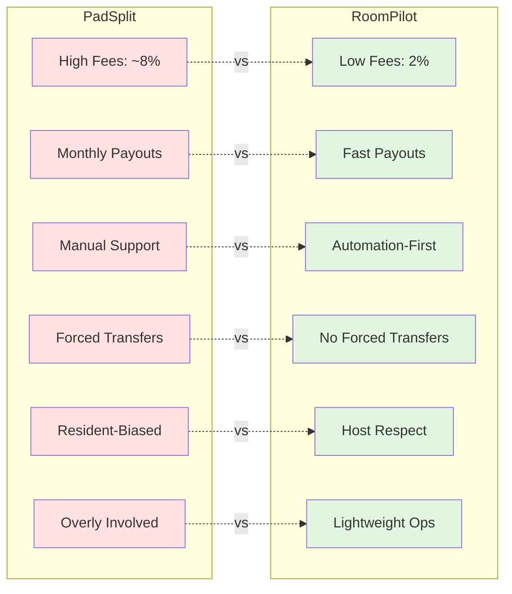

# ROOMPILOT — PRODUCT REQUIREMENTS DOCUMENT (PRD) v1.0

## 1. Product Summary

RoomPilot is an automation-first co-living marketplace for room rentals. It gives hosts PadSplit-style tools without PadSplit's hand-holding, interference, or high fees.

**Core Value:**

RoomPilot provides control, automation, fast payouts, and legitimacy — without corporate involvement.

### Problems With Current Platforms (PadSplit, Alcove, Bungalow)

- High fees (PadSplit charges ~8% + resident upcharges + "first 10 days" fees)
- Constant host interference, micromanagement, and pressure
- Forced "network transfers" that harm hosts
- Manual support → slow, expensive, frustrating
- Legacy tech that feels heavy, corporate, and outdated
- Monthly payouts with 30-day holds
- Hosts feel blamed, not supported

### RoomPilot Fixes This

- Automated billing and reminders
- Low fees (≈2% or flat per-room subscription)
- No required human involvement
- No unnecessary "network" mechanics
- Fast daily or weekly payouts
- Cleaner, modern UI
- Marketplace that relies on Google Ads + SEO to drive demand
- A legitimate-looking platform without bureaucracy

## 2. Differentiators

### 1. No Hand-Holding

Hosts manage their own operations through automation.

### 2. Much Lower Fees

2% fee or $10–$20 per room monthly SaaS.

### 3. Automated Support

Automated payment reminders, late fees, house chats, templates, rules — not humans.

### 4. No Forced Transfers

Residents cannot hop from house to house unless the host approves.

### 5. Fast Payouts

Stripe Connect → payouts in days, not monthly batches.

### 6. Simple Experience for Renters

Renters care about price, location, and availability — not network features.

### 7. Privacy & Security First

Google OAuth sign-in only — no password storage, no personal data handling, instant authentication.

## 3. Target Users

### Hosts

- Room rental operators
- Former or current PadSplit hosts
- Investors with 1–10 homes
- People who want stability without interference

### Renters

- Working-class individuals
- People searching "rooms near me"
- Need something affordable and fast
- Don't compare features
- Don't care about a "network"

## 4. High-Level System Architecture

The platform consists of:

- **Frontend:** React / Next.js
- **Backend:** Node.js or Python API
- **Database:** PostgreSQL
- **Authentication:** Google OAuth 2.0 (Sign in with Google)
- **Payments:** Stripe Connect
- **Messaging:** Firebase Realtime DB or WebSockets
- **File Storage:** AWS S3
- **Background Checks:** Checkr or TransUnion SmartMove

**Authentication Strategy:**
- Single sign-on via Google OAuth only
- No password storage or management
- Store only: Google user ID, email, name, profile picture URL
- Simplified onboarding with pre-filled profile data

### System Architecture Diagram

### Data Flow Diagram

### Database Schema (Entity Relationship)

## 5. Key Features (MVP)

### 5.1 Host Onboarding

- Sign in with Google (one-click authentication)
- Select role (Host or Resident)
- Add properties and rooms
- Upload photos
- Set pricing
- Connect Stripe account
- Publish listing

### 5.2 Resident Onboarding

- Sign in with Google (one-click authentication)
- Complete profile (bio, employment info)
- Optional background check
- Load balance (wallet-style)
- Get approved by host

### 5.3 Marketplace

- Search by price, location
- View rooms
- Request booking
- Auto notification to host

### 5.4 Billing System (Core Feature)

The RoomPilot billing engine includes:

- Resident wallet balance
- Weekly payment deductions
- Auto reminders
- Auto late fees
- Auto insufficient balance notifications
- Host payouts
- Full payment history dashboard

This is the "insane billing system" equivalent BUT rebuilt using automation.

#### Billing System Flow

### 5.5 Communication System

- House group chat
- One-on-one host ↔ resident chat
- Maintenance ticket system
- Auto message templates

### 5.6 Document + Rules System

Auto-generate:

- License agreement
- House rules
- Receipts
- Payment notices

### 5.7 Admin Dashboard

- Properties
- Rooms
- Residents
- Payments
- Applications
- Settings

## 6. User Flows

### 6.1 Host Flow

**Host Flow Steps:**

1. Sign in with Google
2. Select role (Host)
3. Add property details
4. Add rooms and photos
5. Set pricing + rules
6. Connect Stripe account
7. Publish
8. Receive applications
9. Approve
10. Resident loads balance
11. Move-in
12. Weekly automated charges

### 6.2 Resident Flow

**Resident Flow Steps:**

1. Sign in with Google
2. Select role (Resident)
3. Complete profile
4. Search rooms
5. Apply
6. Optional background check
7. Load balance
8. Get approved
9. Move in
10. Weekly automated payments

## 7. Pricing Model

**Option A: Transaction Fee**

2% fee per transaction (vs. PadSplit ~8%).

**Option B: SaaS Fee**

$10–$20 per room monthly.

**Optional Upsells**

- Background checks
- Identity verification
- Service fees

## 8. Competitive Positioning

### Feature Comparison

### PadSplit

- High fees
- Monthly payouts
- Manual support
- Forced network transfers
- Bias toward resident experience
- Overly involved

### RoomPilot

- Low fees
- Fast payouts
- Automation-first
- No forced transfers
- Respect for hosts
- Lightweight operations

## 9. Future Features (Post-MVP)

- Resident ratings / property score
- Automated eviction workflow
- AI fraud detection
- AI resident screening
- Host CRM
- API integrations (Zillow, Facebook Marketplace)
- Advanced automations
- Premium host analytics

## 10. Open Questions

1. Weekly or monthly billing for residents?
2. What is the exact late fee structure?
3. Background checks: required or optional?
4. Are host approvals required or can they auto-approve?
5. Should hosts be able to set custom additional fees?
6. SMS notifications or app-only?
7. Should we support "instant book"?
8. Should we support deposit alternatives (e.g., $50 non-refundable instead of $200 refundable)?

## 11. Next Steps

I can generate any or all of these:

- A cleaned-up **visual UML diagram** for Google Docs
- A **landing page draft** for RoomPilot.pro
- A **pitch deck outline** for investors
- Full **database schema (tables + relationships)**
- Full **API spec (endpoints + methods)**
- A **technical architecture document** (for Richard to code from)
- A **market test landing page** to run Google Ads to validate demand